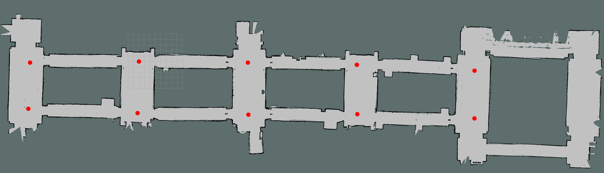

# Mobile robot project - group 3

This project realizes an autonomous motion system using the **ROS** framework for the **turtlebot3 waffle pi** robot. This application was realized by having the **DIEM** as a reference map. The movement of the robot is done through specific points placed on the map known as waypoints and represented by two coordinates.



In order to make the robot move autonomously, it is necessary to provide commands expressing the direction to be taken once the next waypoint is reached. The possible commands to be provided to the robot are *STRAIGHT ON*, *RIGHT*, *LEFT*, *GO BACK* and *STOP*; these must be encoded in QR codes and are placed on the walls along the path.

The operation of the whole system can be reproduced in simulation in the Gazebo environment or in reality.


## Preliminary requirements

Once the repository is cloned perform the `build` of the project.

```bash
cd mobrob-gr3
catkin build
```


## Running in simulation on Gazebo

The commands to be executed in order to start the simulation are as follows:

1. Start the Gazebo simulation environment and Rviz:

   ```bash
   source setup.bash
   roslaunch map2gazebo turtlebot3_diem_sim.launch
   ```

2. Start the webcam on the pc to decode the QRs:

   ```bash
   source setup.bash
   roslaunch qrscan webcam.launch
   ```

   Alternatively, you can directly publish the command in `String` format:

   ```bash
   source setup.bash
   rostopic pub /navigation/command std_msgs/String "data: 'command'"
   ```

   where `command` should be replaced with the command to be given to the robot.

3.  Start the autonomous navigation system:

   ```bash
   source setup.bash
   rosrun navigation nav.py
   ```


## Running with turtlebot3 waffle pi

To start an execution follow the steps below:

1. Start Rviz on which the map will be loaded:

   ```bash
   source setup.bash
   roslaunch map2gazebo turtlebot3_diem.launch
   ```

2. Start the cameras by running:

   ```bash
   source setup.bash
   roslaunch qrscan camera.launch
   ```

3. Start the autonomous navigation system:

   ```bash
   source setup.bash
   rosrun navigation nav.py
   ```


## Manual repositioning

To initiate a manual repositioning, invoke the ROS service `/cancel_goal` as follows.

```bash
source setup.bash
rosservice call /cancel_goal
```


## Branches

The project is divided into two different branches: `hybrid` and `repositioning` . They differ in the logic triggered when the robot reaches a point without having read any command. In the former case, when the robot reaches a waypoint and has not read any command, it goes back to the previous waypoint until a QR is detected; in the latter case, on the other hand, the robot waits to be moved manually to the last waypoint reached correctly.


## Contact

| Full name            | Freshman   | E-mail                          |
| -------------------- | ---------- | ------------------------------- |
| Avitabile Margherita | 0622701825 | m.avitabile6@studenti.unisa.it  |
| Grimaldi Andrea      | 0622701830 | a.grimaldi112@studenti.unisa.it |
| Mignone Lorenzo      | 0622701866 | l.mignone@studenti.unisa.it     |
| Sonnessa Francesco   | 0622701672 | f.sonnessa@studenti.unisa.it    |
